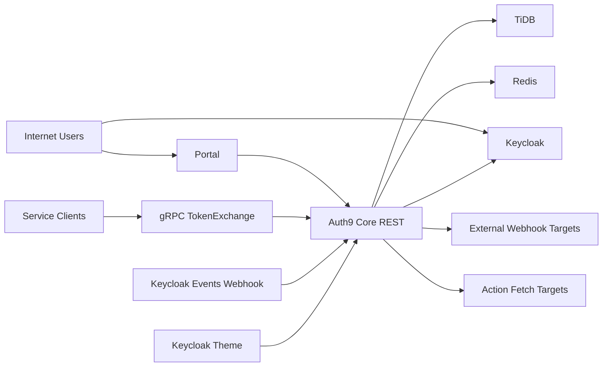

## Executive summary
Auth9 的最高风险集中在多租户授权边界、Token 体系（Identity/TenantAccess/ServiceClient）混淆与降级、以及可出网集成面（Webhook/Action/Keycloak 事件）带来的跨边界滥用。当前代码已具备较强的基础控制（统一鉴权中间件、策略引擎、生产配置 fail-fast、Webhook 签名与去重、gRPC 可切 API Key/mTLS），但在 ASVS 5.0 视角下仍存在覆盖不均：V8/V10/V15/V16 章节的测试映射不足，`auth9-keycloak-theme` 的 `custom_css` 信任边界是最关键的补强点之一。

## Scope and assumptions
- In-scope paths:
  - `auth9-core/src/**`
  - `auth9-portal/app/**`
  - `auth9-keycloak-theme/src/**`
  - `docs/security/**`
  - `deploy/k8s/**`
- Out-of-scope:
  - CI/CD 平台本身（GitHub/GHCR/K8s 控制平面）实现细节
  - 第三方组件内部实现（Keycloak、TiDB、Redis、浏览器）
- Clarified assumptions:
  - 合规目标为“整体 ASVS L2 + 高风险域部分 L3”。
  - 审计范围包含 portal、theme。
  - 本轮输出以文档补完和可执行测试任务为主。
- Open questions:
  - 生产是否启用 WAF/API Gateway 的协议规范化（影响 HTTP smuggling 优先级）。
  - 生产是否限制 `system/branding.custom_css` 的写入主体仅平台管理员（影响 theme 注入风险等级）。

## System model
### Primary components
- `auth9-portal`：React Router 7 SSR 前端，服务端会话 Cookie，后端代理 API 调用。
- `auth9-core`：Rust Axum + Tonic，提供 REST 与 gRPC（TokenExchange）。
- `Keycloak`：OIDC IdP，Auth9 通过 Admin API 管理用户/IdP/会话。
- `TiDB`：持久化租户、用户、RBAC、审计、集成配置。
- `Redis`：黑名单、OIDC state、限流与缓存。
- `auth9-keycloak-theme`：登录主题，运行时从 `/api/v1/public/branding` 拉取品牌配置并注入 CSS。

### Data flows and trust boundaries
- Internet User -> Portal
  - Data: OIDC 跳转参数、会话 Cookie、表单输入
  - Channel: HTTPS/HTTP
  - Security: Portal Cookie `HttpOnly`/`SameSite=Lax`，服务端 token 刷新
  - Validation: 表单校验 + 服务端路由权限
- Portal -> Core REST
  - Data: Bearer token、租户/用户操作、系统配置、Webhook/Action 配置
  - Channel: HTTP(S)
  - Security: `require_auth_middleware` + `policy::enforce`
  - Validation: DTO 校验、授权策略、路径守卫、body 限制、限流
- Service Client -> Core gRPC TokenExchange
  - Data: identity token、tenant/service 标识、roles/token introspection
  - Channel: gRPC + (api_key/mTLS)
  - Security: `GRPC_AUTH_MODE`、生产 `validate_security()` 强制限制
  - Validation: 成员关系校验、服务租户一致性、TOCTOU re-check
- Core -> Keycloak Admin API
  - Data: 用户、凭证、IdP、会话、realm 配置
  - Channel: HTTP(S)
  - Security: 管理 token 缓存、超时、错误处理
  - Validation: 业务级授权后再调用
- Keycloak events webhook -> Core `/api/v1/keycloak/events`
  - Data: 登录事件、错误、IP、session
  - Channel: HTTP webhook
  - Security: HMAC 签名（生产要求）、5 分钟时间窗、去重（Redis/内存回退）
  - Validation: JSON 反序列化、事件类型映射
- Core -> External URLs (Webhook/Action fetch)
  - Data: webhook payload、action script HTTP requests
  - Channel: HTTP(S)
  - Security: 域名 allowlist、私网 IP 拦截、重试/timeout、请求上限
  - Validation: URL 解析、DNS 解析后私网检查、response bytes 限制

#### Diagram

## Assets and security objectives
| Asset | Why it matters | Security objective (C/I/A) |
|---|---|---|
| Identity/TenantAccess/Service JWT | 可直接控制跨租户访问与管理操作 | C/I |
| Tenant membership + RBAC bindings | 多租户隔离根基，篡改即越权 | I |
| Platform system settings (email/branding/templates) | 影响全租户安全通知与信任链 | I/A |
| Webhook secrets / Keycloak webhook secret | 事件伪造与数据外流关键 | C/I |
| Session blacklist + OIDC state in Redis | 登出、撤销与登录流抗重放 | I/A |
| Audit/security alert logs | 检测与追溯能力基础 | I/A |
| Action scripts + allowlist config | 可变执行逻辑，影响 SSRF/数据外发 | I/C |
| Theme branding `custom_css` | 登录页内容与可视信任边界 | I |

## Attacker model
### Capabilities
- 远程匿名攻击者：可访问公开 REST/gRPC/OIDC 入口，构造恶意输入、重放请求、并发触发。
- 已认证低权限租户用户：可尝试 IDOR、越权写配置、跨租户访问。
- 受限供应链攻击者：可通过依赖/Jar 变更影响事件链路或前端构建。
- 被动网络观察者（非 TLS 场景）：可捕获 token/code 并重放。

### Non-capabilities
- 不能直接访问 TiDB/Redis/K8s 节点 shell。
- 不能直接修改后端二进制与容器镜像（除非供应链被攻破）。
- 不能绕过签名算法本身（关注的是实现与配置弱点）。

## Entry points and attack surfaces
| Surface | How reached | Trust boundary | Notes | Evidence (repo path / symbol) |
|---|---|---|---|---|
| `/api/v1/auth/authorize` `/callback` `/token` | Browser/Portal | Internet -> Core | OIDC state、redirect_uri、code exchange | `auth9-core/src/domains/identity/api/auth.rs` |
| Protected REST routes `/api/v1/**` | Bearer token | User -> Core | 统一鉴权 + policy | `auth9-core/src/server/mod.rs`, `auth9-core/src/middleware/require_auth.rs`, `auth9-core/src/policy/mod.rs` |
| gRPC `TokenExchange/*` | gRPC client | Service -> Core | api_key/mTLS/none 模式差异 | `auth9-core/src/server/mod.rs`, `auth9-core/src/grpc/token_exchange.rs` |
| Keycloak events webhook | POST body + signature | Keycloak -> Core | HMAC + timestamp + dedup | `auth9-core/src/domains/integration/api/keycloak_event.rs` |
| Webhook test/trigger outbound | tenant webhook config | Core -> External | DNS+private IP 校验、重试 | `auth9-core/src/domains/integration/service/webhook.rs` |
| Action fetch op | action script runtime | Core -> External | allowlist + private IP block + req limit | `auth9-core/src/domains/integration/service/action_engine.rs` |
| Theme branding API + custom CSS | Keycloak login pages | Core -> Browser | `dangerouslySetInnerHTML` 注入 CSS | `auth9-keycloak-theme/src/login/components/BrandingProvider.tsx` |
| Session cookie + token refresh | Portal SSR routes | Browser -> Portal | HttpOnly/SameSite + refresh/exchange | `auth9-portal/app/services/session.server.ts` |

## Top abuse paths
1. 攻击者拿到 Identity token -> 调用 tenant-token 交换非所属租户 -> 若成员校验缺陷则获得跨租户访问 -> 读取/篡改租户数据。
2. 低权限用户调用 `/api/v1/system/*` -> 若 policy 规则漏校验 -> 修改 branding/email/template -> 钓鱼或通知劫持。
3. 未授权 gRPC 客户端在 `GRPC_AUTH_MODE=none` 回归时直接调用 `ExchangeToken` -> 批量枚举服务/租户 -> 获取可用访问令牌。
4. 伪造 Keycloak 事件（无签名或签名配置缺失）-> 注入大量失败/成功登录事件 -> 干扰检测或诱发告警疲劳。
5. 恶意租户配置 webhook/action URL -> 通过 DNS rebinding / 内网地址探测 -> 打探内网服务或 metadata endpoint。
6. 管理员可写 `custom_css` -> 在登录页覆盖 UI/误导输入 -> 凭证钓鱼与品牌信任破坏。
7. 攻击者重放旧 OIDC state/code 或 token -> 若过期和一次性检查缺陷 -> 会话接管。

## Threat model table
| Threat ID | Threat source | Prerequisites | Threat action | Impact | Impacted assets | Existing controls (evidence) | Gaps | Recommended mitigations | Detection ideas | Likelihood | Impact severity | Priority |
|---|---|---|---|---|---|---|---|---|---|---|---|---|
| TM-001 | 已认证低权限用户 | 获取合法 token 且知道其他 tenant/service 标识 | 滥用 token exchange 或资源接口进行跨租户访问 | 横向越权与数据泄露 | RBAC、租户数据 | 成员校验+服务租户校验+TOCTOU re-check（`grpc/token_exchange.rs`） | 仍需覆盖更多并发/异常路径测试 | 对关键跨租户路径强制双重租户一致性断言；补充并发回归测试 | 统计 `permission_denied`/`service_tenant_mismatch` 比例告警 | medium | high | high |
| TM-002 | 已认证租户用户 | 具有 tenant token | 调用 system/admin 操作端点越权写配置 | 全局配置篡改、钓鱼链路 | system settings、email templates | `policy::enforce`、平台管理员校验（`policy/mod.rs`） | 文档覆盖偏点状，ASVS V8/V13 映射不足 | 对全部 `/api/v1/system/*` 建立 deny-by-default 权限清单测试 | 审计日志 `access_denied` + 高频 denied IP/user 告警 | medium | high | high |
| TM-003 | 远程匿名/外部客户端 | gRPC 配置回归或弱配置 | 在 `none` 模式调用 TokenExchange | 非授权 token 获取/枚举 | JWT、租户权限 | 生产 fail-fast 禁止 `none`（`config/mod.rs::validate_security`） | 非生产环境可能被误用于 staging | 在 CI 加“禁止 none/reflection”策略检查；staging 同步生产策略 | 启动时安全配置指标 + gRPC unauthenticated 监控 | low | high | medium |
| TM-004 | 外部 webhook 伪造者 | 知道 webhook endpoint，secret 缺失或泄露 | 伪造 Keycloak 登录事件/重放事件 | 监控污染，误报漏报 | login events、alerts | HMAC、时间窗、dedup（`integration/api/keycloak_event.rs`） | dev/staging 常见未配置 secret；fallback 内存 dedup 可被重启绕过 | 所有环境强制 secret；增加 `event_id + nonce` 强约束 | 监控 signature failure、expired event、dedup hit rate | medium | medium | medium |
| TM-005 | 恶意租户管理员 | 可配置 webhook/action URL | 利用 SSRF 访问内网或 metadata | 内网信息泄漏、侧向移动 | infra metadata、internal services | allowlist + private IP blocking + DNS resolve check（`action_engine.rs`, `webhook.rs`） | 域名 allowlist 误配、DNS rebinding 仍需持续验证 | 加入解析后 IP pinning 与 CIDR denylist 回归测试 | 记录 outbound destination/ASN 异常 | medium | high | high |
| TM-006 | 平台管理员误用/被劫持 | 可写 branding 配置 | 注入恶意 `custom_css` 诱导输入 | 账号钓鱼、品牌信任损害 | login trust boundary | 支持动态 branding（`useBranding.ts`, `BrandingProvider.tsx`） | `dangerouslySetInnerHTML` 直接注入 CSS，缺少白名单过滤 | 引入 CSS sanitizer 或仅允许变量级覆盖；禁用 `@import/url()` | 记录 branding 变更审计 + 登录失败异常波动 | medium | medium | medium |
| TM-007 | 远程攻击者 | 截获 state/code/token 或利用过期窗口 | 重放授权流程/会话 token | 会话接管 | OIDC state、session | OIDC state 存储并消费一次（`store_oidc_state/consume_oidc_state`）；JWT strict leeway | 需统一覆盖 refresh/tenant exchange 复合流程 | 增加 state/code/token 重放 e2e 套件并并发化 | 指标化 `invalid_state`, `invalid_grant`, revoked token hits | medium | high | high |

## Criticality calibration
- critical:
  - 直接跨租户数据读取/写入（TM-001 的成功利用）。
  - 无认证获取可用业务 token（TM-003 在生产发生）。
  - webhook/action 导致内网敏感资源泄露且可稳定复现（TM-005）。
- high:
  - 高权限配置越权（TM-002）。
  - OIDC/token 重放导致会话接管（TM-007）。
- medium:
  - 事件伪造导致检测质量下降但未形成直接接管（TM-004）。
  - `custom_css` 引发登录界面诱导风险（TM-006）。
  - staging 配置弱化但生产有强控制（TM-003 降级场景）。
- low:
  - 仅信息暴露且无跨租户/凭证影响。
  - 需高度不现实前置条件（集群内部访问 + 多重失配）。
  - 可被现有限流/审计快速阻断的低影响探测。

## Focus paths for security review
| Path | Why it matters | Related Threat IDs |
|---|---|---|
| `auth9-core/src/middleware/require_auth.rs` | REST 鉴权入口，token 类型与路径约束核心 | TM-001, TM-007 |
| `auth9-core/src/policy/mod.rs` | 全局授权策略中心，决定 system/admin 边界 | TM-002 |
| `auth9-core/src/domains/identity/api/auth.rs` | OIDC authorize/callback/token 关键流 | TM-007 |
| `auth9-core/src/grpc/token_exchange.rs` | 跨租户 TokenExchange 核心逻辑与 TOCTOU 防护 | TM-001, TM-003 |
| `auth9-core/src/server/mod.rs` | gRPC/REST 组装与全局中间件顺序、安全模式 | TM-003 |
| `auth9-core/src/config/mod.rs` | 生产安全 fail-fast 与默认值来源 | TM-003, TM-004 |
| `auth9-core/src/domains/integration/api/keycloak_event.rs` | 入站 webhook 签名、时间窗、去重 | TM-004 |
| `auth9-core/src/domains/integration/service/webhook.rs` | 出站 webhook SSRF 防护关键点 | TM-005 |
| `auth9-core/src/domains/integration/service/action_engine.rs` | 动态脚本与 fetch allowlist/私网拦截 | TM-005 |
| `auth9-keycloak-theme/src/login/components/BrandingProvider.tsx` | `custom_css` 注入信任边界 | TM-006 |
| `auth9-keycloak-theme/src/login/hooks/useBranding.ts` | 主题配置拉取来源与降级逻辑 | TM-006 |
| `auth9-portal/app/services/session.server.ts` | Portal 会话 Cookie 与 refresh/exchange 路径 | TM-007 |
| `deploy/k8s/configmap.yaml` | 生产公网地址、CORS 与 issuer 等关键配置 | TM-003, TM-007 |

## Quality check
- [x] 覆盖了已发现主要入口（REST/gRPC/OIDC/webhook/theme/session/action）。
- [x] 每条信任边界至少在威胁中出现一次。
- [x] 已纳入用户确认的范围与目标（L2 + 部分 L3，含 portal/theme）。
- [x] 假设与未确认项已显式标注。
