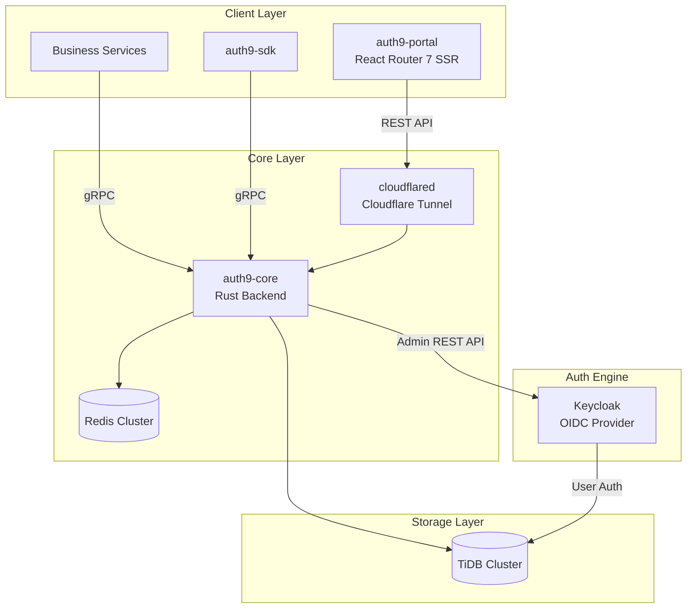
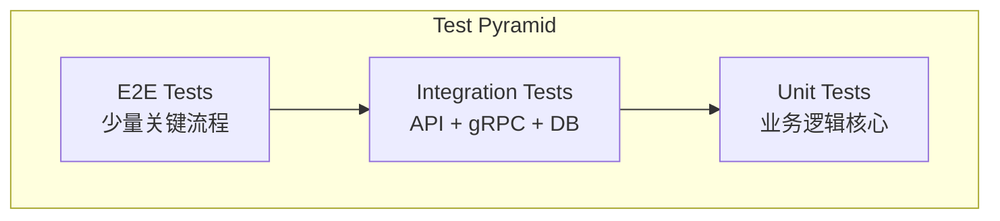
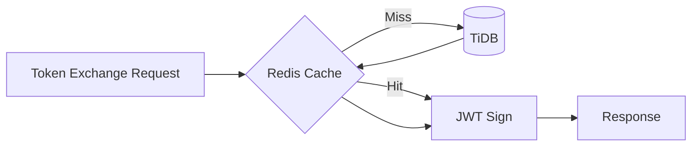

# Auth9 架构设计文档

## 1. 项目概述

Auth9 是一个自托管的身份认证服务，设计用于替代昂贵的 Auth0 等商业解决方案。系统作为 Keycloak 的包装层，提供多租户管理、SSO 单点登录和动态 RBAC 能力。

### 1.1 核心理念

- **Headless Keycloak**: Keycloak 仅负责核心协议（OIDC）、MFA 和基础账号存储
- **管理面与数据面合一**: Identity Service 承载管理 UI 及其对应的 API 服务
- **Token 瘦身**: 通过 Token Exchange 策略，将庞大的租户/角色信息从初始登录 Token 中剥离，按需交换

### 1.2 项目组成

| 组件 | 定位 | 职责 |
|------|------|------|
| **auth9-portal** | Management UI | 提供精美的 Dashboard 供租户管理员配置用户、角色和审计日志 |
| **auth9-core** | Business Logic Backend | Keycloak 包装器，管理本地数据库，Token Exchange 处理器 |
| **auth9-sdk** | Optional SDK | 给其他服务的极简接入包，封装 gRPC 调用逻辑 |

## 2. 系统架构

### 2.1 架构总览



### 2.2 部署模型

- **环境**: Kubernetes 集群
- **组件**:
  - auth9-portal: 3000 端口，2-6 副本
  - auth9-core: 8080 (HTTP) + 50051 (gRPC)，3-10 副本
  - TiDB: 集群现有，4000 端口
  - Redis: 集群，6379 端口
  - Keycloak: 认证引擎，不暴露公网

## 3. 技术栈选择

### 3.1 后端 (auth9-core) - Rust

| 领域 | 技术选择 | 理由 |
|------|----------|------|
| Web Framework | **axum** | Tower 生态、高性能、类型安全 |
| gRPC | **tonic** | Rust 原生 gRPC 实现 |
| 数据库 | **sqlx** | 编译时 SQL 检查、TiDB(MySQL)兼容 |
| JWT | **jsonwebtoken** | 成熟稳定的 JWT 库 |
| 缓存 | **redis-rs** | Redis 客户端 |
| 序列化 | **serde** | 标准序列化方案 |
| 配置 | **config-rs** | 多环境配置管理 |
| 日志 | **tracing** | 结构化日志 + 分布式追踪 |
| 异步运行时 | **tokio** | Rust 标准异步运行时 |
| 测试 | **tokio-test + mockall + wiremock** | 完整测试框架（无外部依赖） |

### 3.2 前端 (auth9-portal) - React Router 7

| 领域 | 技术选择 | 理由 |
|------|----------|------|
| 框架 | **React Router 7 + TypeScript** | 全栈 Web 框架，SSR/SSG 支持 |
| 构建工具 | **Vite** | 快速开发体验 |
| 测试框架 | **Vitest** | Vite 原生测试框架 |
| UI 组件 | **Radix UI + Tailwind CSS** | 无样式组件 + 原子化CSS |
| 状态管理 | **React Router loader/action + Zustand** | 服务端优先 |
| 表单验证 | **Zod + Conform** | 类型安全的表单处理 |
| E2E 测试 | **Playwright** | 端到端测试 |

### 3.3 苹果风格 UI 设计原则

- **极简主义**: 大量留白、简洁线条
- **毛玻璃效果**: `backdrop-filter: blur()` 半透明背景
- **圆角设计**: 大圆角卡片和按钮 (`rounded-2xl`)
- **微妙动画**: 细腻的 hover/focus 过渡效果
- **系统字体**: SF Pro Display / Inter
- **色彩克制**: 主色调为中性灰 + 单一强调色

## 4. 模块架构设计

### 4.1 auth9-core 模块结构

```
auth9-core/
├── src/
│   ├── main.rs
│   ├── lib.rs
│   ├── config/                         # 配置管理
│   ├── domains/                        # 领域化模块（主入口）
│   │   ├── mod.rs                      # DomainRouterState 聚合约束
│   │   ├── identity/
│   │   │   ├── api/                    # auth/session/password/webauthn...
│   │   │   ├── service/                # session/password/webauthn/oidc...
│   │   │   ├── context.rs
│   │   │   ├── routes.rs
│   │   │   └── services.rs             # 领域 service facade
│   │   ├── tenant_access/
│   │   ├── authorization/
│   │   ├── platform/
│   │   ├── integration/
│   │   └── security_observability/
│   ├── api/                            # 兼容层 + 通用 HTTP 类型/函数
│   ├── grpc/                           # gRPC services
│   ├── domain/                         # 核心领域模型（实体/值对象）
│   ├── repository/                     # 数据访问层
│   ├── service/                        # 兼容层（re-export 到 domains）
│   ├── server/                         # Router 组装与启动
│   ├── keycloak/                       # Keycloak Admin API 客户端
│   ├── jwt/                            # JWT 签发与验证
│   ├── cache/                          # Redis 缓存层
│   └── error/                          # 统一错误处理
├── tests/                # 集成测试
│   ├── common/           # 测试工具
│   ├── api/              # API 集成测试
│   └── grpc/             # gRPC 集成测试
├── proto/                # gRPC proto 定义
├── migrations/           # 数据库迁移
├── Dockerfile
└── Cargo.toml
```

> 说明：`src/api/*` 与 `src/service/*` 在重构阶段保留为兼容 shim（`pub use crate::domains::...`），外部行为保持不变。

### 4.2 auth9-portal 模块结构

```
auth9-portal/
├── app/
│   ├── root.tsx
│   ├── entry.client.tsx
│   ├── entry.server.tsx
│   ├── routes/           # React Router 7 路由 (文件系统路由)
│   │   ├── _index.tsx
│   │   ├── _auth.login.tsx
│   │   ├── dashboard.tsx
│   │   ├── tenants._index.tsx
│   │   ├── tenants.$id.tsx
│   │   ├── users._index.tsx
│   │   ├── services._index.tsx
│   │   ├── roles._index.tsx
│   │   └── audit-logs.tsx
│   ├── components/
│   │   ├── ui/           # 基础组件 (Button, Input, Card...)
│   │   └── features/     # 功能组件
│   ├── lib/              # 工具函数
│   ├── services/         # API 服务层
│   └── styles/           # 全局样式
├── tests/
│   ├── unit/             # 单元测试 (vitest)
│   └── e2e/              # E2E 测试 (playwright)
├── public/
├── Dockerfile
├── vite.config.ts
├── vitest.config.ts
└── package.json
```

## 5. 数据库设计 (TiDB)

### 5.1 ER 关系图

```mermaid
erDiagram
    tenants ||--o{ tenant_users : has
    tenants ||--o{ services : owns
    users ||--o{ tenant_users : belongs
    services ||--o{ permissions : declares
    services ||--o{ roles : defines
    roles ||--o{ role_permissions : contains
    permissions ||--o{ role_permissions : assigned
    tenant_users ||--o{ user_tenant_roles : has
    roles ||--o{ user_tenant_roles : assigned

    tenants {
        uuid id PK
        varchar name
        varchar slug UK
        varchar logo_url
        json settings
        varchar status
        timestamp created_at
        timestamp updated_at
    }

    users {
        uuid id PK
        varchar keycloak_id UK
        varchar email UK
        varchar display_name
        varchar avatar_url
        boolean mfa_enabled
        timestamp created_at
        timestamp updated_at
    }

    tenant_users {
        uuid id PK
        uuid tenant_id FK
        uuid user_id FK
        varchar role_in_tenant
        timestamp joined_at
    }

    services {
        uuid id PK
        uuid tenant_id FK
        varchar name
        varchar client_id UK
        varchar client_secret_hash
        text base_url
        json redirect_uris
        json logout_uris
        varchar status
        timestamp created_at
    }

    ### 5.3 私有服务与公共服务

    服务（Service）通过 `tenant_id` 字段区分类型：

    | 类型 | tenant_id | 说明 |
    |------|-----------|------|
    | 私有服务 | 有值（非 NULL） | 专属某个租户的服务，如租户自己的业务 API |
    | 公共服务 | NULL | 不属于任何特定租户，所有租户可通过 `tenant_services` 关联使用 |

    **设计原则**：
    - **公共服务**：如 Auth9 Admin Portal，提供给所有租户使用，不专属于任何租户
    - **私有服务**：如租户自己注册的业务服务，仅该租户可用

    通过 `tenant_services` 表实现多租户对公共服务的关联使用。

    permissions {
        uuid id PK
        uuid service_id FK
        varchar code UK
        varchar name
        varchar description
    }

    roles {
        uuid id PK
        uuid service_id FK
        varchar name
        varchar description
        uuid parent_role_id FK
    }

    role_permissions {
        uuid role_id FK
        uuid permission_id FK
    }

    user_tenant_roles {
        uuid id PK
        uuid tenant_user_id FK
        uuid role_id FK
        timestamp granted_at
        uuid granted_by FK
    }

    audit_logs {
        bigint id PK
        uuid actor_id FK
        varchar action
        varchar resource_type
        uuid resource_id
        json old_value
        json new_value
        varchar ip_address
        timestamp created_at
    }
```

### 5.2 表说明

**核心表**（ER 图已展示）：

| 表名 | 用途 |
|------|------|
| `tenants` | 租户信息，包含名称、slug、配置等 |
| `users` | 用户信息，关联 Keycloak ID |
| `tenant_users` | 用户-租户多对多关系 |
| `services` | OIDC 客户端/服务注册 |
| `permissions` | 权限点定义（如 user:read） |
| `roles` | 角色定义，支持继承 |
| `role_permissions` | 角色-权限映射 |
| `user_tenant_roles` | 用户在租户中的角色分配 |
| `audit_logs` | 审计日志 |

**扩展表**（ER 图未展示，通过迁移文件管理）：

| 表名 | 用途 |
|------|------|
| `sessions` | 会话追踪（设备信息、IP 地址） |
| `password_reset_tokens` | 密码重置令牌（HMAC 签名） |
| `invitations` | 租户邀请（Token、状态） |
| `webhooks` | Webhook 配置（URL、事件类型、HMAC 密钥） |
| `actions` | Action 脚本（触发器、脚本内容、执行统计） |
| `action_execution_logs` | Action 执行日志 |
| `login_events` | 登录事件分析 |
| `security_alerts` | 安全告警（暴力破解、异地登录等） |
| `linked_identities` | 外部身份链接（社交登录） |
| `webauthn_credentials` | WebAuthn/Passkey 凭证 |
| `system_settings` | 系统配置（AES-GCM 加密存储） |
| `tenant_services` | 租户-服务启用关系 |
| `enterprise_sso_connectors` | 企业 SSO 连接器（SAML/OIDC） |

## 6. API 设计

### 6.1 REST API

按 6 个领域组织，以下为主要端点（非完整列表）：

#### Identity 域
| 端点 | 方法 | 描述 |
|------|------|------|
| `/api/v1/auth/authorize` | GET | OIDC 授权入口 |
| `/api/v1/auth/callback` | GET | OIDC 回调 |
| `/api/v1/auth/token` | POST | Token 端点 |
| `/api/v1/auth/logout` | GET/POST | 登出 |
| `/api/v1/auth/tenant-token` | POST | Token Exchange (Identity → Tenant Access) |
| `/api/v1/auth/userinfo` | GET | 用户信息 |
| `/api/v1/auth/forgot-password` | POST | 忘记密码 |
| `/api/v1/auth/reset-password` | POST | 重置密码 |
| `/api/v1/auth/webauthn/authenticate/*` | POST | WebAuthn 认证 |
| `/api/v1/users/me/passkeys` | GET/POST/DELETE | Passkey 管理 |
| `/api/v1/users/me/sessions` | GET/DELETE | 会话管理 |
| `/api/v1/identity-providers` | CRUD | 身份提供商管理 |

#### Tenant Access 域
| 端点 | 方法 | 描述 |
|------|------|------|
| `/api/v1/tenants` | GET/POST | 租户列表/创建 |
| `/api/v1/tenants/{id}` | GET/PUT/DELETE | 租户详情/更新/删除 |
| `/api/v1/users` | GET/POST | 用户列表/创建 |
| `/api/v1/users/{id}` | GET/PUT/DELETE | 用户详情/更新/删除 |
| `/api/v1/users/{id}/tenants` | GET/POST | 用户-租户关联 |
| `/api/v1/tenants/{id}/invitations` | GET/POST | 邀请管理 |
| `/api/v1/tenants/{id}/sso/connectors` | CRUD | 租户 SSO 连接器 |

#### Authorization 域
| 端点 | 方法 | 描述 |
|------|------|------|
| `/api/v1/services` | GET/POST | 服务列表/注册 |
| `/api/v1/services/{id}` | GET/PUT/DELETE | 服务详情 |
| `/api/v1/services/{id}/clients` | GET/POST | 客户端管理 |
| `/api/v1/roles` | POST | 创建角色 |
| `/api/v1/roles/{id}` | GET/PUT/DELETE | 角色管理 |
| `/api/v1/permissions` | POST | 创建权限 |
| `/api/v1/rbac/assign` | POST | 分配角色 |
| `/api/v1/tenants/{id}/services` | GET/POST | 租户-服务关联 |

#### Integration 域
| 端点 | 方法 | 描述 |
|------|------|------|
| `/api/v1/tenants/{id}/webhooks` | CRUD | Webhook 管理 |
| `/api/v1/tenants/{id}/actions` | CRUD | Action 管理 |
| `/api/v1/tenants/{id}/actions/batch` | POST | Action 批量操作 |
| `/api/v1/tenants/{id}/actions/{id}/test` | POST | 测试 Action 执行 |
| `/api/v1/actions/triggers` | GET | 获取可用触发器 |

#### Platform 域
| 端点 | 方法 | 描述 |
|------|------|------|
| `/api/v1/system/email` | GET/PUT | 邮件配置 |
| `/api/v1/system/email-templates` | GET | 邮件模板管理 |
| `/api/v1/system/branding` | GET/PUT | 品牌配置 |
| `/api/v1/public/branding` | GET | 公开品牌信息 |

#### Security & Observability 域
| 端点 | 方法 | 描述 |
|------|------|------|
| `/api/v1/audit-logs` | GET | 审计日志查询 |
| `/api/v1/analytics/login-stats` | GET | 登录统计 |
| `/api/v1/analytics/login-events` | GET | 登录事件 |
| `/api/v1/analytics/daily-trend` | GET | 每日趋势 |
| `/api/v1/security/alerts` | GET | 安全告警 |
| `/health` | GET | 健康检查 |
| `/ready` | GET | 就绪检查 |

### 6.2 gRPC API (服务间调用)

```protobuf
service TokenExchange {
  // 交换租户访问令牌
  rpc ExchangeToken(ExchangeTokenRequest) returns (ExchangeTokenResponse);
  // 验证令牌
  rpc ValidateToken(ValidateTokenRequest) returns (ValidateTokenResponse);
  // 获取用户在租户中的角色
  rpc GetUserRoles(GetUserRolesRequest) returns (GetUserRolesResponse);
  // Token 内省
  rpc IntrospectToken(IntrospectTokenRequest) returns (IntrospectTokenResponse);
}
```

## 7. Token 设计

### 7.1 Identity Token (主令牌)

```json
{
  "iss": "https://auth9.example.com",
  "sub": "user-uuid",
  "aud": "auth9",
  "exp": 1234567890,
  "iat": 1234567890,
  "email": "user@example.com",
  "name": "User Name"
}
```

### 7.2 Tenant Access Token (租户访问令牌)

```json
{
  "iss": "https://auth9.example.com",
  "sub": "user-uuid",
  "aud": "service-client-id",
  "exp": 1234567890,
  "iat": 1234567890,
  "tenant_id": "tenant-uuid",
  "roles": ["editor", "viewer"],
  "permissions": ["user:read", "user:write", "report:export"]
}
```

## 8. 测试设计

### 8.1 测试金字塔



### 8.2 auth9-core 测试策略

**单元测试** (`src/*/tests.rs`):
- `domain/` - 领域模型验证逻辑
- `service/` - 业务逻辑（使用 mockall mock 依赖）
- `jwt/` - Token 签发与验证
- `cache/` - 缓存序列化/反序列化

**集成测试** (`tests/`):
- 使用 mockall + wiremock，无需 Docker 或外部服务
- `tests/api/` - REST API 端到端测试
- `tests/grpc/` - gRPC 服务测试

### 8.3 测试命令

```bash
# 单元测试 (快速)
cargo test --lib

# 集成测试 (零外部依赖，mockall + wiremock)
cargo test --test '*'

# 全部测试
cargo test

# 覆盖率报告
make coverage-html
```

## 9. 性能优化策略

### 9.1 缓存策略 (满足 20ms Token 交换要求)



**缓存内容**:
- 用户-租户-角色映射 (TTL: 5min)
- 服务配置信息 (TTL: 10min)
- JWKS 公钥 (TTL: 1hour)

### 9.2 高可用部署

```yaml
replicas: 3
resources:
  requests:
    cpu: 500m
    memory: 512Mi
  limits:
    cpu: 2000m
    memory: 2Gi
strategy:
  type: RollingUpdate
  rollingUpdate:
    maxSurge: 1
    maxUnavailable: 0
```

## 10. 安全设计

- **Secrets 管理**: 敏感配置存储于 K8s Secrets
- **Admin API 保护**: Identity Service 与 Keycloak 的交互在 K8s 内部网络完成
- **Token 校验**: 所有 Access Token 必须包含 aud (Audience) 校验
- **密码哈希**: 使用 Argon2 算法
- **HTTPS**: 生产环境强制 TLS

## 11. 核心流程

### 11.1 认证流程

```
用户访问业务服务 -> 发现无 Token
    ↓
重定向 -> Keycloak 认证页面
    ↓
认证成功 -> Keycloak 带 Code 回跳业务服务
    ↓
换取 Token -> 业务服务拿到 Identity Token
    ↓
Token Exchange -> 业务服务通过 gRPC 请求 Identity Service
    ↓
返回结果 -> 业务服务获得包含 Tenant_A: [Editor] 角色的 Access Token
```

### 11.2 架构师建议

1. **SPI 扩展**: 如需极致实时性，建议在 Keycloak 中实现 EventListener SPI，通过消息队列实时通知用户状态变更
2. **网关集成**: 建议将 Token Exchange 逻辑下沉到 API Gateway 层，让业务服务对认证完全无感
